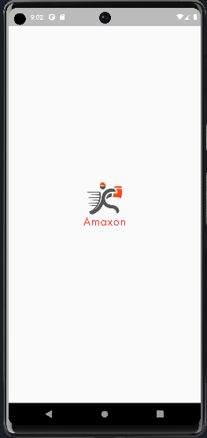
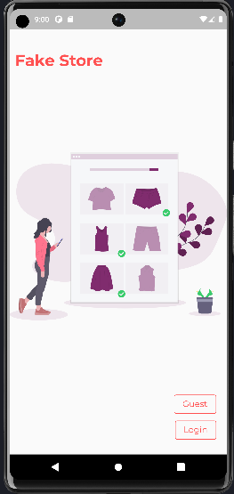
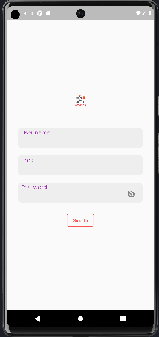
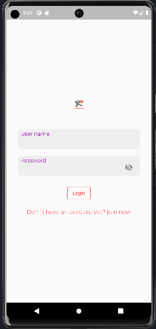
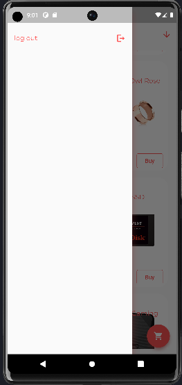
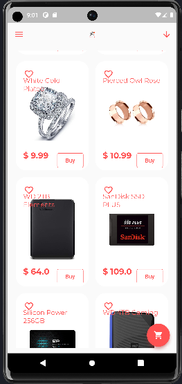
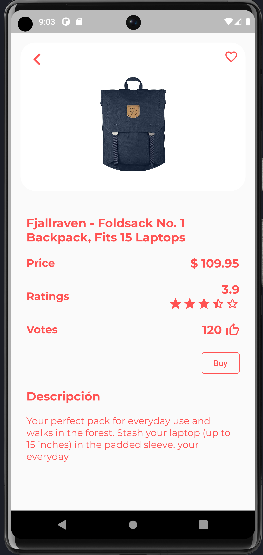

# FakeStore
This is a Flutter app that consumes the FakeStore API.
It includes all functionalities included in the API such as authentication, cart, wishlist, 
and products. The app has a feature-based folder structure and uses the GetX state management library.
# Features
## Authentication()
 -Users can register and sign in to the app.
 
## Products(ongoing)
 -Users can view a list of products available on the FakeStore API.
 -The app displays a banner section with a card slider showing different images and names of the products.
 -Users can add products to their cart or wishlist. 
 ##Cart(not implemented)
 -Users can view a list of products in their cart.
 -Users can remove item from their cart.
## Wishlist(not implemented)
 -Users can view a list of products in their wishlist.
 -Users can remove items from their wishlist.
 

## OS
1. Android

## Language Application Support
English 

## Framework and language
1. Flutter v- 3.3.2
2. Dart

## Libraries
1. get
2. shared_preferences
3. http
4. modal_progress_hud_nsn
5. cached_network_image
6. flutter_launcher_icons
7. flutter_svg

## API's

https://fakestoreapi.com/

 
## Images
## flash screen

## first screen

## signup 

## login

## signout

## products

## product_detail

## cart (coming soon)
## wishlist (coming soon)

#credits
This app was created as part of a Flutter development project. The following resources were used in the development of this app:

1. Flutter documentation
2. FakeStore API
3. GetX library documentation
##License
This project is licensed under the MIT License. See the LICENSE file for more information.